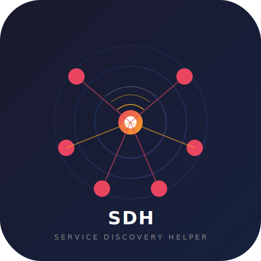

<div align="center">
  

  [](https://github.com/slgfire/service-discovery-helper/actions)
  [](https://github.com/slgfire/service-discovery-helper/releases)
  [](LICENSE)

  **📡 UDP broadcast forwarder that makes game server discovery work across VLANs — built for LAN parties**

  [Releases](https://github.com/slgfire/service-discovery-helper/releases) · [Game Compatibility](GAMES.md)
</div>

---

## Overview

Running a LAN party with hundreds of PCs on one broadcast domain doesn't scale. The solution is VLANs — but then game server discovery breaks, because UDP broadcasts don't cross VLAN boundaries.

**service-discovery-helper** (SDH) fixes this. It listens for UDP broadcasts on whitelisted ports and retransmits them across your network interfaces. Game clients send discovery broadcasts, SDH forwards them to every other VLAN, and servers respond directly via unicast. Your game traffic stays untouched.

## ✨ Features

- **Selective forwarding** — only whitelisted UDP ports are forwarded, no accidental DHCP or SSDP leaks
- **Rate limiting** — optional per-source-IP+port rate limiter prevents broadcast storms and loops
- **Multi-architecture** — pre-built binaries for x86_64, ARM64 and ARM 32-bit (Raspberry Pi)
- **Auto-detect interfaces** — use `-a` to listen on all available network interfaces
- **Stat logging** — optional packet statistics to file for InfluxDB ingestion
- **Lightweight** — single binary, no dependencies beyond libpcap

## 🚀 Quick Start

### Pre-built binaries

Download from the [Releases page](https://github.com/slgfire/service-discovery-helper/releases):

| File | Architecture |
|------|-------------|
| `sdh-proxy-linux-x86_64.tar.gz` | Linux x86_64 (64-bit) |
| `sdh-proxy-linux-aarch64.tar.gz` | Linux ARM64 (Raspberry Pi 4/5, 64-bit OS) |
| `sdh-proxy-linux-armhf.tar.gz` | Linux ARM 32-bit (Raspberry Pi 2/3/4, 32-bit OS) |

```bash
tar xzf sdh-proxy-linux-*.tar.gz
sudo apt install libpcap0.8       # runtime dependency (all platforms)
sudo ./sdh-proxy -p ports -i interfaces -r
```

### Build from source

```bash
sudo apt install build-essential libpcap-dev
make
sudo ./sdh-proxy -p ports -i interfaces -r
```

## ⚙️ Usage

```
sudo ./sdh-proxy [-p ports-file] [-i interfaces-file] [-a] [-r] [-t ms] [-l] [-d] [-h]
```

| Flag | Description |
|------|-------------|
| `-p <file>` | Port whitelist file (can be specified multiple times) |
| `-i <file>` | Interface list file (can be specified multiple times) |
| `-a` | Auto-detect and use all interfaces |
| `-r` | Enable rate limiting per source IP + destination port |
| `-t <ms>` | Rate limiter timeout in ms (default: 1000, implies `-r`) |
| `-l` | Enable stat logging to `sdh.stat` |
| `-d` | Debug output |
| `-h` | Show help |

### Configuration files

**`ports`** — one port or port range per line, `#` for comments:

```
# Source Engine (TF2, CS:GO, etc.)
27015-27020

# Warcraft 3
6112
```

**`interfaces`** — one interface name per line:

```
eth0
eth0.100
eth0.101
```

See [GAMES.md](GAMES.md) for a full list of tested games and their discovery ports.

### Example setup

Trunk your VLANs to a dedicated PC, create the sub-interfaces, then run SDH:

```bash
sudo modprobe 8021q
sudo ip link add link eth0 name eth0.100 type vlan id 100
sudo ip link add link eth0 name eth0.101 type vlan id 101
sudo ip link add link eth0 name eth0.102 type vlan id 102
sudo ./sdh-proxy -p ports -a -r -t 750
```

### Advanced: bridging VLANs

If you can't trunk every VLAN to one point, create a bridging VLAN and run multiple SDH instances. For example, with bridging VLAN 100 and user VLANs 101-104:

- Instance 1: VLANs 100, 101, 102
- Instance 2: VLANs 100, 103, 104

Packets broadcast onto VLAN 100 get rebroadcast by the other instance.

## 🛡️ Rate Limiting

Rate limiting is **strongly recommended**. It prevents broadcast storms if a loop forms and throttles spammy applications.

Each packet's source IP + destination port pair is tracked. If the same combination was forwarded within the timeout window, the duplicate is dropped. This means legitimate multi-port discovery (e.g., Steam scanning ports 27015-27020) works fine, while loops or floods are contained.

The default timeout of 1000ms is a safe starting point. DreamHack Germany ran 1,500 users successfully with `-t 750`.

## 📊 Stat Logging

Enable with `-l` to write packet statistics to `sdh.stat`. Use [this script](https://gist.github.com/solariz/29362abbcf45605ab700df6f6e6be141) to ingest the data into InfluxDB.

## 🎮 Tested Games

| Game | Status | Ports |
|------|--------|-------|
| Source Engine (TF2, CS:S, CS:GO) | ✅ Works | 27015-27020 |
| Warcraft 3 / Frozen Throne | ✅ Works | 6112 |
| Trackmania / Shootmania | ✅ Works | 2350-2360 |
| Unreal Tournament 2004 | ✅ Works | 10777 |
| ARMA 2 / DayZ | ✅ Works | 2302-2470 |
| Warsow | ✅ Works | 44400 |
| FlatOut 2 | ✅ Works | 23757 |
| Blur | ✅ Works | 50001 |
| OpenTTD | ❌ Not working | 3979 |

Full details in [GAMES.md](GAMES.md).

## ⚠️ Important Notes

- Only **one** SDH instance per VLAN. Multiple instances on shared VLANs **will** cause a broadcast loop.
- SDH only forwards broadcasts — your game/application traffic (unicast) routes normally through your existing infrastructure.
- Requires root privileges for packet capture and injection.
- Source IP and MAC addresses are not verified. Use rate limiting in untrusted environments.

## 🏟️ Used At

- **PAX Aus 2016** — PC gaming area
- **DreamHack Germany 2017** — 1,500 users on the LAN

## 📄 License

[MIT](LICENSE) — (c) Chris "SirSquidness" Holman, 2013

---

<div align="center">
  <sub>⭐ Star this repo if SDH saved your LAN party!</sub>
</div>
